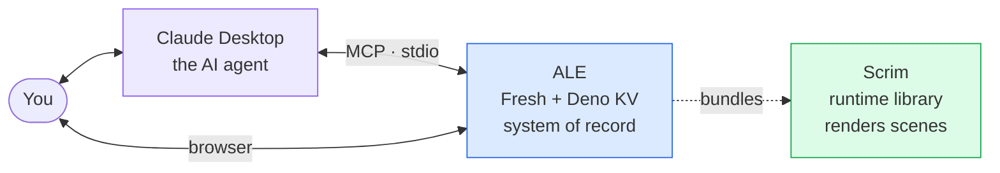
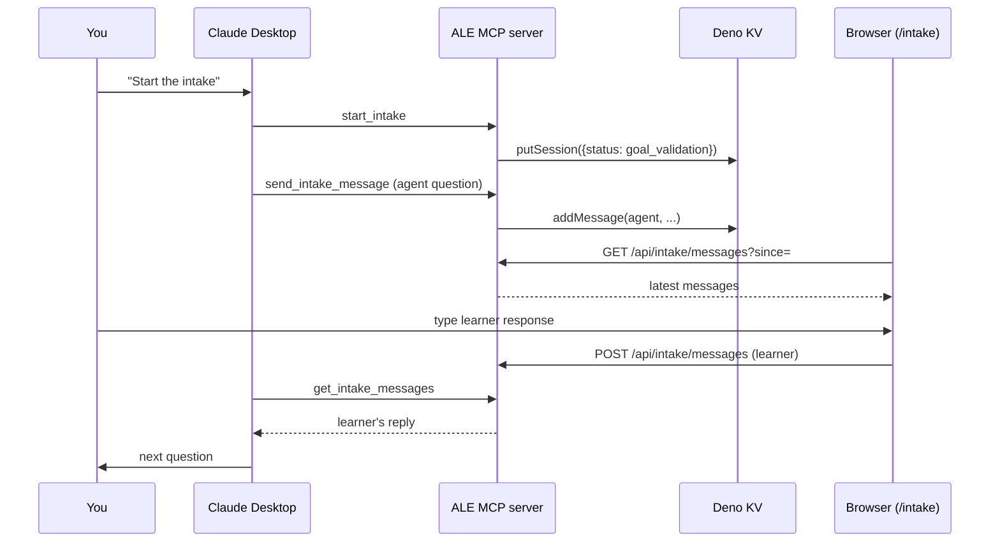
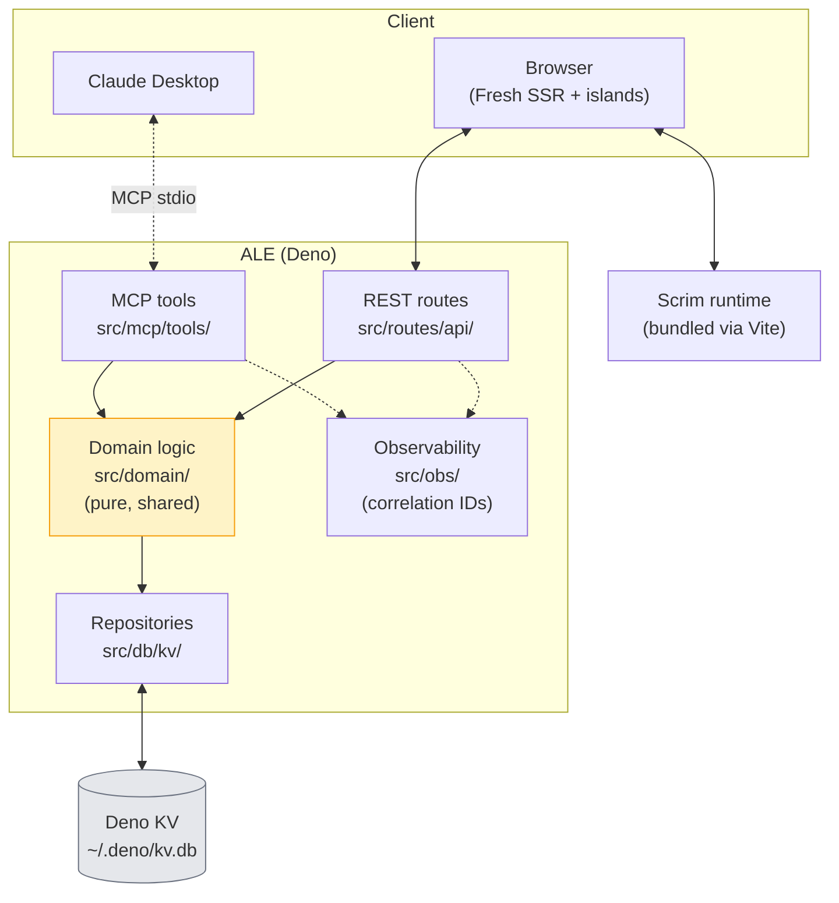

<h1 align="center">Adaptive Learning Engine</h1>

<p align="center">
  <em>AI as the engine, not the owner.</em>
</p>

<p align="center">
  
  
  
  
  
</p>

ALE is a self-hosted adaptive learning platform. You bring a curriculum as
three YAML files; an AI agent (Claude, or any other MCP-compatible agent)
becomes your coach. The web app owns all your data. The AI is replaceable —
the [MCP protocol](https://modelcontextprotocol.io) is the contract. ALE
works as a standalone learning tracker even with no agent connected.



---

<details>
<summary><strong>Table of contents</strong></summary>

1. [What you'll have at the end of this guide](#1-what-youll-have-at-the-end-of-this-guide)
2. [Before you start — prerequisites](#2-before-you-start--prerequisites)
3. [Clone both repos — the sibling layout](#3-clone-both-repos--the-sibling-layout)
4. [Start the web app](#4-start-the-web-app)
5. [Start the MCP server (for ad-hoc testing)](#5-start-the-mcp-server-for-ad-hoc-testing)
6. [Connect Claude Desktop](#6-connect-claude-desktop)
7. [Your first intake](#7-your-first-intake)
8. [Your first week](#8-your-first-week)
9. [Try the other example — `k8s-hybrid-cloud`](#9-try-the-other-example--k8s-hybrid-cloud)
10. [Troubleshooting](#10-troubleshooting)
11. [Going deeper — doc map](#11-going-deeper--doc-map)
12. [Architecture at a glance](#12-architecture-at-a-glance)
13. [Tech stack](#13-tech-stack)
14. [Development commands](#14-development-commands)
15. [Core concept: everything is a bridge](#15-core-concept-everything-is-a-bridge)
16. [Contributing](#16-contributing)
17. [License](#17-license)

</details>

---

## 1. What you'll have at the end of this guide

> [!TIP]
> A local ALE running the **`learning-ale`** course — a self-referential
> curriculum that teaches you how ALE itself is built — with Claude Desktop
> coaching you through week 1.

When setup is complete you'll have:

- **Terminal 1:** Fresh dev server on `http://localhost:5188` (your
  dashboard, today view, intake chat, retention).
- **Claude Desktop:** connected to ALE as an MCP server, with a menu of
  tools like `get_dashboard`, `start_intake`, `create_day_content`.
- **A conversation:** Claude asking you intake questions in the browser
  via the ALE UI, driven from your Claude Desktop chat.

Total time from zero to talking to your coach: ~10 minutes.

---

## 2. Before you start — prerequisites

- [ ] **Deno 1.39 or later** — [install](https://docs.deno.com/runtime/getting_started/installation/).
      ALE uses Deno KV (unstable), Fresh 2, and the npm `@modelcontextprotocol/sdk`.
- [ ] **Git**.
- [ ] **Claude Desktop** with a working Anthropic login —
      [download](https://claude.ai/download). macOS and Windows are stable;
      Linux is in beta at time of writing.
- [ ] **~1 GB free disk** — both repos + Deno's module cache.

> [!NOTE]
> You do **not** need Node or npm (Deno resolves everything). You do **not**
> need an Anthropic API key in ALE — Claude Desktop uses its own
> subscription when it talks to the MCP server.

---

## 3. Clone both repos — the sibling layout

ALE's `src/deno.json` imports [Scrim](https://github.com/meije702/scrim)
(the scene-rendering runtime) from a **sibling directory**
(`../../scrim/`). Both repos must live next to each other.

```text
your-workspace/
├── adaptive-learning-engine/   ← this repo
└── scrim/                      ← sibling
```

```bash
mkdir your-workspace && cd your-workspace
git clone https://github.com/meije702/adaptive-learning-engine.git
git clone https://github.com/meije702/scrim.git
```

> [!IMPORTANT]
> If you clone ALE without Scrim next to it, `deno task dev` fails with
> `Cannot find module '@scrim/core'` before the app starts. The import
> map in `src/deno.json` points at `../../scrim/packages/*/mod.ts`.

<details>
<summary>Why a sibling checkout and not a published package?</summary>

Scrim is co-developed with ALE and evolves alongside it. Until the API
stabilises, ALE consumes Scrim's source directly through a relative
path in the import map (see the `@scrim/*` entries in
[`src/deno.json`](./src/deno.json)). The MCP SDK bridge in
`src/mcp/sdk_compat.js` documents a similar rationale for the MCP SDK.
Both are deliberate — don't "fix" them.

</details>

---

## 4. Start the web app

```bash
cd adaptive-learning-engine/src
deno task dev
```

Open **<http://localhost:5188>**.

**What you should see on a fresh install:**

- Dashboard header: *"Understanding the Adaptive Learning Engine"*.
- A yellow **"Intake vereist"** banner at the top (it will read
  *"Intake required — ..."* once Claude generates content in English,
  the default language of `learning-ale`).
- An empty knowledge graph — domains listed, all at level 0.
- Nav: **Dashboard · Today · Intake · Retention** plus a small theme
  switcher on the right.

<!-- TODO: screenshot of fresh dashboard -->

> [!NOTE]
> Port `5188` is hardcoded (`strictPort`) via `src/vite.config.ts`. If
> another process holds it you'll get a clear failure — see §10.

---

## 5. Start the MCP server (for ad-hoc testing)

```bash
cd adaptive-learning-engine/src
deno task mcp
```

This starts the MCP server on stdio — useful for testing with MCP tools
like `mcp inspect` but **optional** for normal use.

> [!WARNING]
> The server communicates over `stdin`/`stdout`. Don't pipe or redirect
> its output; that's the protocol channel.

> [!NOTE]
> In normal operation Claude Desktop launches **its own** copy of the
> MCP server via the config in §6. You can skip this step once that's
> set up. It only matters if you want to drive the MCP server
> manually.

---

## 6. Connect Claude Desktop

Claude Desktop has built-in support for MCP servers. You add ALE once in a
config file and Claude launches it automatically.

<details>
<summary><strong>Find your Claude Desktop config file</strong></summary>

- **macOS:** `~/Library/Application Support/Claude/claude_desktop_config.json`
- **Windows:** `%APPDATA%\Claude\claude_desktop_config.json`
- **Linux (beta):** `~/.config/Claude/claude_desktop_config.json`

If the file doesn't exist, create it.

</details>

Paste this (replace the `/ABSOLUTE/PATH/...` with your actual path; run
`pwd` inside `adaptive-learning-engine` to print it):

```json
{
  "mcpServers": {
    "adaptive-learning-engine": {
      "command": "deno",
      "args": [
        "run",
        "-A",
        "--unstable-kv",
        "/ABSOLUTE/PATH/TO/adaptive-learning-engine/src/mcp/main.ts"
      ]
    }
  }
}
```

> [!IMPORTANT]
> **Quit and relaunch Claude Desktop** after editing the config. It only
> reads the file on startup.

**Verify:** in a new Claude Desktop chat, the tool-menu icon (bottom-left
of the input) should list ALE tools — `get_dashboard`, `start_intake`,
`create_day_content`, `set_wellbeing_status`, and ~20 more. If the list
is empty, see §10.

---

## 7. Your first intake

In Claude Desktop, start a new chat and say:

> *"Let's start the intake for the Adaptive Learning Engine course."*

Claude will:

1. Call `start_intake` — ALE creates an `IntakeSession` in KV.
2. Call observe tools (`get_progress`, etc.) — read the curriculum and
   your learner profile.
3. Ask you goal-validation questions, as described in
   [`CLAUDE.md`](./CLAUDE.md).

**In parallel**, open <http://localhost:5188/intake> in your browser. The
chat thread there mirrors the conversation — your responses go through
ALE's REST API and Claude reads them on its next call.



When the intake completes, Claude calls `complete_intake` — ALE seeds
baseline `Progress` entries for every domain in phase 1, marks intake
done, and sets `wellbeing.status = "active"`. The dashboard banner
disappears on next refresh.

---

## 8. Your first week

ALE's default schedule (from `config/examples/learning-ale/learner.config.yaml`):

| Mon | Tue | Wed | Thu | Fri | Sat | Sun |
|---|---|---|---|---|---|---|
| Theory | Practice (guided) | Practice (open) | Practice (troubleshoot) | Assessment | Review | Rest |

Week 1 of `learning-ale` is compressed — all four **Mental Model**
domains (`system-topology`, `bridge-principle`, `coach-stance`,
`mcp-contract`) land inside the same week, one per theory/practice day.
See the full curriculum in
[`config/examples/learning-ale/curriculum.config.yaml`](./config/examples/learning-ale/curriculum.config.yaml).

From week 2 onwards you get one domain per week, stepping through data
at rest → domain logic → runtime + flow → design system, with assessment
stretches interleaved.

> [!TIP]
> The agent reads [`docs/ale-context.md`](./docs/ale-context.md) when
> generating day content. If you change the architecture mid-course,
> update that file and the next generated day reflects your changes.

---

## 9. Try the other example — `k8s-hybrid-cloud`

A richer real-world curriculum aimed at CKA / hybrid-cloud engineering.
Good reference for what a full-depth ALE course looks like.

```bash
cd adaptive-learning-engine/src
ALE_CONFIG_DIR=../config/examples/k8s-hybrid-cloud deno task dev
```

> [!NOTE]
> Deno KV is **per-user, not per-project**. Switching `ALE_CONFIG_DIR`
> without clearing KV mixes learner state across curricula — you'll see
> your `learning-ale` progress on the k8s dashboard. For clean isolation,
> edit `src/db/kv.ts` to use a project-local file (e.g.
> `Deno.openKv("file:./local.db")`), or `rm ~/.deno/kv.db` between
> switches. This is
> [tracked as a known rough edge](./docs/ale-context.md).

---

## 10. Troubleshooting

<details>
<summary><code>Cannot find module '@scrim/core'</code> on startup</summary>

**Why.** ALE's `src/deno.json` imports Scrim from `../../scrim/`. The
path is relative and the directory is missing.

**Fix.** Check the sibling layout from §3. From inside
`adaptive-learning-engine/src`, `ls ../../scrim/packages/core/mod.ts`
should resolve. If not, clone Scrim next to ALE.

</details>

<details>
<summary>Claude Desktop tool menu is empty after editing config</summary>

**Why.** Config file typo, wrong absolute path, missing `--unstable-kv`,
or Claude Desktop wasn't restarted.

**Fix.**
1. Verify the JSON parses — paste it into `jq .` or a JSON linter.
2. Confirm the absolute path with `pwd`; it must end with
   `src/mcp/main.ts`.
3. Ensure `"--unstable-kv"` is in the `args` array.
4. **Fully quit** Claude Desktop (Cmd-Q / right-click tray icon) and
   relaunch — a window close isn't enough.
5. Still empty? Run the command manually to see the error:
   ```bash
   deno run -A --unstable-kv /ABSOLUTE/PATH/.../src/mcp/main.ts
   ```

</details>

<details>
<summary><code>Port 5188 is in use</code></summary>

**Why.** Another process holds the port. Vite is configured with
`strictPort: true` so it won't silently fall back.

**Fix.** Find and stop the other process:
```bash
lsof -i :5188 | tail -1
```
Or temporarily change the port in `src/vite.config.ts` (search for
`port: 5188`), but remember to change it back before committing.

</details>

<details>
<summary>REST endpoints return 401 Unauthorized</summary>

**Why.** You've set the `ALE_AUTH_TOKEN` environment variable, which
turns on bearer-token auth for `/api/*` routes.

**Fix.** For local browser use, unset it:
```bash
unset ALE_AUTH_TOKEN
```
For external scripts, send the token:
```bash
curl -H "Authorization: Bearer $ALE_AUTH_TOKEN" http://localhost:5188/api/dashboard/summary
```
Auth is skipped entirely when `ALE_AUTH_TOKEN` is unset — browser pages
are always accessible.

</details>

<details>
<summary>Intake page looks stuck waiting for the AI</summary>

**Why.** The MCP connection between Claude Desktop and ALE isn't active,
so Claude never called `start_intake`.

**Fix.** Re-verify §6. Ask Claude in the Desktop chat whether it can
call `get_dashboard`; if it can't, the MCP link is down and Claude will
say so.

</details>

<details>
<summary>Learner state from a previous curriculum bleeds through</summary>

**Why.** Shared per-user Deno KV. See §9's note.

**Fix.** Either clear KV (`rm ~/.deno/kv.db`) before switching curricula,
or isolate by editing `src/db/kv.ts` to pass a file path to
`Deno.openKv`.

</details>

<details>
<summary>The dashboard is empty after restart — where did my data go?</summary>

**Why.** Nothing went missing. Deno KV persists at `~/.deno/kv.db`
(macOS/Linux) or `%APPDATA%\deno\kv.db` (Windows). If you cleared that
file, data is gone.

**Fix.** If you see zero progress but expected some, check:
```bash
ls -la ~/.deno/kv.db*
```
And confirm `ALE_CONFIG_DIR` hasn't changed between sessions.

</details>

---

## 11. Going deeper — doc map

Ordered by when you're likely to want each.

| Doc | Read when | Covers |
|---|---|---|
| [AGENTS.md](./AGENTS.md) | Before touching code | Deno layout, MCP SDK bridge, where things live, test conventions |
| [docs/SYSTEM.md](./docs/SYSTEM.md) | Understanding the pedagogy | Weekly cycle, intake, wellbeing, retention, coaching stance |
| [docs/technical-design.md](./docs/technical-design.md) | Mapping the architecture | Full internals, data flow, integration points |
| [docs/design-system.md](./docs/design-system.md) | Styling or adding presets | Tokens, aliases, theming, 12 fitness functions |
| [docs/ale-context.md](./docs/ale-context.md) | Living architectural map | What's stable, what's in motion; the agent reads this |
| [CLAUDE.md](./CLAUDE.md) | Tuning agent behaviour | Coaching contract — how Claude should respond |
| [docs/adr/001-data-model-api.md](./docs/adr/001-data-model-api.md) | Data-model questions | Entity + API contract |
| [docs/adr/002-configuration-first.md](./docs/adr/002-configuration-first.md) | Config questions | Why config-first |
| [docs/adr/003-bridge-principle-intake.md](./docs/adr/003-bridge-principle-intake.md) | Intake / bridge questions | The recursive bridge principle |
| [docs/research/learning-science.md](./docs/research/learning-science.md) | Curiosity | Evidence behind spaced repetition, interleaving, feedback |
| [DESIGN.md](./DESIGN.md) | One-page pitch | Design philosophy in 134 lines |

---

## 12. Architecture at a glance



Key invariant: any business rule called from both REST and MCP lives in
`src/domain/`. Both surfaces are thin wrappers. Correlation IDs flow
through `AsyncLocalStorage` so a single request can be traced across
boundaries.

---

## 13. Tech stack

| Layer | Technology |
|---|---|
| Runtime | Deno (unstable KV) |
| Web framework | Fresh 2 (SSR + islands) |
| Frontend | Preact |
| Build | Vite |
| Database | Deno KV |
| AI protocol | MCP (Model Context Protocol) |
| Scene runtime | [Scrim](https://github.com/meije702/scrim) (sibling repo) |
| Validation | Zod |
| Language | TypeScript throughout |

---

## 14. Development commands

Run all commands from `src/` unless noted.

| Command | Purpose | Essential |
|---|---|---|
| `deno task dev` | Start Fresh dev server on `:5188` | **yes** |
| `deno task mcp` | Start MCP server on stdio (ad-hoc testing) | optional |
| `deno task check` | `fmt` + `lint` + type-check + design-token scripts | **yes**, pre-commit |
| `deno task test:check` | Type-check main entrypoints + run the full test suite | **yes**, CI |
| `deno task test` | Tests only (skips type-check; faster inner loop) | dev |
| `deno task build` | Production build | deploy |
| `deno task start` | Build + serve compiled app | deploy |
| `deno task check:design` | Just the design-token scripts (wired into `check`) | troubleshooting |
| `deno task update` | Bump Fresh deps to latest | maintenance |

---

## 15. Core concept: everything is a bridge

Every step in the learning process is a transformation from a known state
(`from`) to a desired state (`to`). This pattern is recursive — it
applies at every level: curriculum, phase, domain, week, day.

The `from` can be empty. Not everyone has prior knowledge. The system
detects this and adapts: where an experienced professional learns through
analogy, a beginner learns through first principles.

Before the weekly cycle begins, the system runs an intake to validate the
learner's goal, estimate the gap, and advise whether the plan is
realistic.

---

## 16. Contributing

See [AGENTS.md](./AGENTS.md) for:

- Development conventions (where things live, test style)
- Commit style (conventional prefixes, small focused commits)
- MCP / Scrim gotchas (`src/mcp/sdk_compat.js` is a deliberate bridge)
- Fitness functions — architectural invariants enforced in CI

Before your first PR, run:

```bash
cd src
deno task check && deno task test:check
```

Both must be green.

---

## 17. License

[MIT](./LICENSE).
